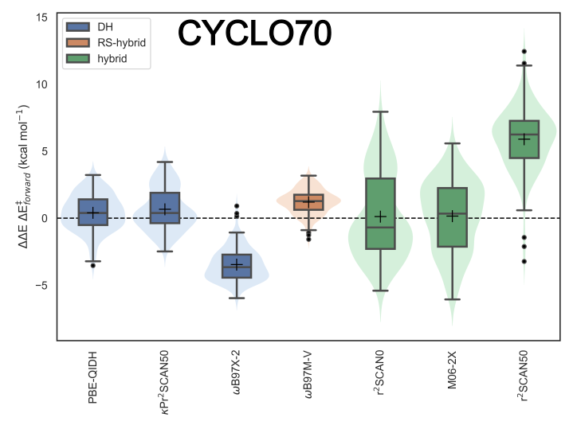

# cyclo70_benchmark
Code to support the "CYCLO70: A New Challenging Pericyclic Benchmarking Set for Kinetics and Thermochemistry Evaluation" project



## Requeriments

The following packages are necessary for the analysis of the data and generation of the figures.

     Package         Version
    * pandas      == 2.2.2
    * numpy       == 1.26.4
    * seaborn     == 0.13.2
    * sckit-learn == 1.3.2

## Analysis of the data

The script used to compute all the statistics descriptors and generated the plots is `visualize_analyze.py`. 

## Interactive plot

Uploading `interactive_plot.ipynb` on [Google Colab](https://colab.research.google.com/) you will be able to explore the Figure 7, where the Principal Component Analysis is displayed. 

## References

```
@article{cyclo70_benchmarkg,
  author = {Alfonso-Ramos, Javier E. and Adamo, Carlo and Br{\'e}mond, {\'E}ric and Stuyver, Thijs},
  title = {CYCLO70: A New Challenging Pericyclic Benchmarking Set for Kinetics and Thermochemistry Evaluation.},
  journal = {ChemRxiv},
  year = {2025},
}
```
